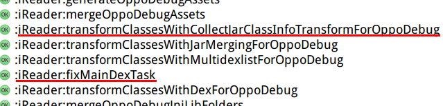
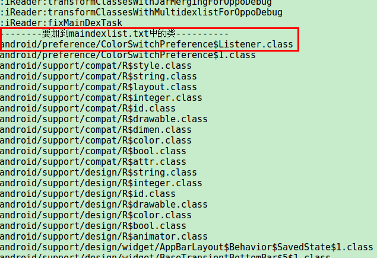

# Gradle脚本实现provided方式依赖远程project
## 问题由来
- 在Android中开发插件时,插件如需依赖某些远程库,有可能主工程也依赖这些库,比如官方的support库com.android.support:design:xxx
- 这时要求插件构建过程中不能带入这些库的代码,要在运行时使用主工程中的
- 插件为了编译通过,需要以provided方式依赖这些库的代码,而Android Gradle插件不允许provided方式依赖远程project
- 最原始的做法是,手动将这些库的代码打入jar包中,然后provided方式依赖这个jar包
- 但这个做法太费力了,每当远程库有更新,就需要手动重复上面的过程
## 演示
  
这个external-support-lib-jars目录里,存放着全部"com.android.support:design:26.0.0"远程project所包含的代码的jar包
## 如何配置
- 在build.gradle的dependencies{}块之前,创建一个新的configuration名叫providedExternalModule:
```groovy
   configurations {
      providedExternalModule.setTransitive(true)
   }
   
   dependencies {
   ....
```  
- 在build.gradle的dependencies{}块中,将想以provided方式依赖的远程库,用providedExternalModule方式依赖:
```groovy
   dependencies {
      ....
      providedExternalModule "com.android.support:design:26.0.0"
      ....
   }
```
- 在build.gradle的最后,引入本脚本:
```groovy
   apply from: "provided_project.gradle"
```
- 最后,也是最简单的一步,拷贝脚本provided_project.gradle到build.gradle的同级目录

## 原理
- Android Gradle插件不允许以provided方式依赖aar包或任何project(本地或远程),这是无法改变的
- "provided"是一种configuration,我们可以自定义一个configuration,利用它的asPath方法获取用这个configuration依赖的远程库的所有aar包路径
- 远程库的aar包在用户的gradle缓存目录里,利用上一步得到的路径,可以找到这些aar包,提取其内部的jar包,然后都拷贝到特定目录里
- 最后,用provided方式依赖特定目录里的所有jar包

# Gradle脚本补足mainDex中缺失的内部类
## 问题由来
- 在Android构建过程中,如果java代码总方法数超过65536,就需要进行MultiDex处理,将代码分散到多个Dex中
- 在Android 4.4及以下系统上,应用启动时会先加载apk中的classes.dex,再通过MultiApplication加载其它classesX.dex
- 这个最先加载的classes.dex,称为mainDex,应包含应用启动过程中所需的最低限度的代码.如果缺少了某些类,会导致NoClassDefFound异常,进而崩溃
- 从线上情况看,有些<4.4的手机,mainDex中包含某个类A.class,但不包含这个类的匿名内部类A$B.class,导致启动应用时,A.class调用A$B.class导致崩溃
- 本Gradle脚本的功能就是补足mainDex中缺失的A$B.class这样的内部类
## 演示
 
- 使用本脚本后,构建过程中transformClassesWithMultidexlist和transformClassesWithDex两个默认的task中,加入了一个新task:fixMainDexTask

- 

